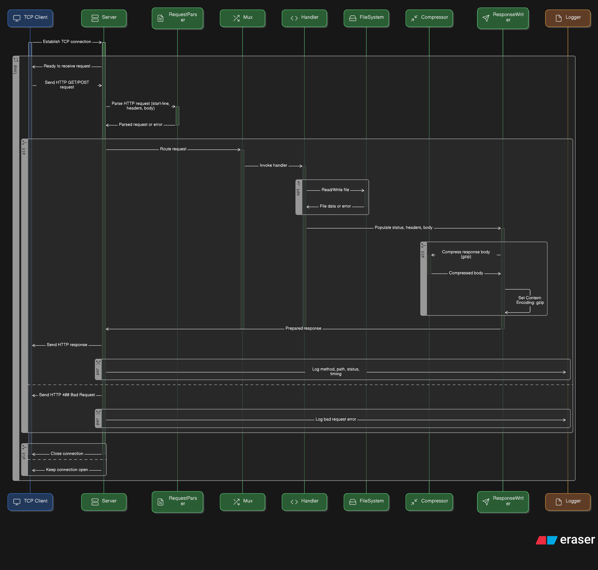

# Build Your Own HTTP/1.1 Server in GO

This is a fully functional HTTP/1.1 server implemented from scratch using only low-level networking primitives provided by the Go standard library. It was created as a systems-level learning project to explore how web servers operate at the lowest level, including TCP socket management, manual HTTP parsing, and concurrent connection handling

## Motivation

This project was built to:

1. Deepen understanding of how HTTP and TCP networking work under the hood.
2. Strengthen systems programming skills, especially around concurrency, sockets, and I/O
3. Practice Go by focusing on idiomatic structuring, testing, and low-level networking construct

## Architecture Overview

[](https://app.eraser.io/workspace/FYSASdrkbQBewFpGFG2k?origin=share&elements=-_-aFc0Y2JKy9nMgS26QJQ)

## Features

- Manual TCP server using `net.Listen` and `Accept`
- Manual HTTP/1.1 request parsing (method, path, headers)
- Supports basic HTTP routes:
  - `GET /` — Health check
  - `GET /echo/<msg>` — Echoes message in response body
  - `GET /user-agent` — Returns `User-Agent` header
  - `GET /files/<filename>` — Return a file content
  - `POST /files/<filename>` — Saves request body to disk
- Gzip compression for clients that support it (`Accept-Encoding: gzip`)
- Concurrency using goroutines (one per connection)
- Persistent connections
- Proper request body reading and `Content-Length` handling
- 404 Not Found for unknown routes
- Graceful connection closing (`Connection: close`, EOF handling)
- Prevents directory traversal (e.g., `../`)
- Includes structured logging (standard `slog` package) for connections and route handling.
- No third-party dependencies — only Go standard library

## How to run

1. clone the repository

```bash
git clone https://github.com/raphico/go-http-server-scratch.git
cd go-http-server-scratch
```

2. Run the server

```bash
go run cmd/server/main.go
```

3. Try it out

```bash
curl http://localhost:4221/
curl http://localhost:4221/echo/hello
curl -v --header "User-Agent: foobar/1.2.3" http://localhost:4221/user-agent
curl -v -H "Accept-Encoding: gzip" http://localhost:4221/echo/abc | hexdump -C
curl -v --data "12345" -H "Content-Type: application/octet-stream" http://localhost:4221/files/file_123
curl -i http://localhost:4221/files/foo
curl -i http://localhost:4221/files/non_existant_file
```

## Folder structure

| File/Folder                     | Purpose                              |
| ------------------------------- | ------------------------------------ |
| `cmd/server/main.go`            | Application entry point              |
| `internal/server/server.go`     | TCP socket and connection management |
| `internal/protocol/request.go`  | HTTP request parsing                 |
| `internal/protocol/response.go` | HTTP response generation             |
| `internal/protocol/header.go`   | HTTP header management               |
| `internal/handler`              | Handler functions                    |
| `internal/mux/mux.go`           | Request router (multiplexer)         |
| `internal/compress`             | Gzip compression support             |

## Key Lessons learned

1. Idiomatic Go Design
   - The use of small, focused packages(like mux, handler, protocol, server) to separation functionality into logical units
   - The use of structs to model real-world entities(like Request, Response, Header, Mux, Server) with associated methods(e.g. Set, Write, Send, HandleFunc) to manipulate and mange these entities
   - Emulated Go’s http package architecture with structs + methods + interface-based handlers
2. Networking & Protocol internals
   - What TCP sockets are: one endpoint of a two-way communication link made up of an IP address and a Port number
   - Built a manual TCP server using the net package
   - manually parsed HTTP/1.1 request and constructed valid responses
   - Implemented persistent connections with graceful connection closing (via EOF or Connection: close)
   - Added Gzip compression based on Accept-Encoding
3. Buffered I/O efficiency
   - Used `bufio.Reader` to efficiently read TCP connections in chunks
   - Learned that reusing the buffered Reader across requests improves efficiency and reduces allocation overhead
   - Used a `Strings.Builder` to construct response strings efficiently, avoiding repeated allocation with `+` and `fmt.Sprintf`
4. Concurrency with Goroutines
   - Leveraged goroutines to handle multiple connections concurrently.
   - Understood that goroutines are lightweight, non-blocking, and managed by Go’s runtime scheduler
   - Also learned that the main goroutine must stay alive (e.g., via loops or proper synchronization with channels) or the server will exit prematurely
5. Design patterns and architecture
   - Applied dependency injection for a more decoupled design
   - Used factory pattern for initialization of Responses, Multiplexer, and Server
   - Avoided hardcoding status codes, routing logic, methods, for flexibility and clarity
6. Designed a basic router with Method-based pattern parsing(`GET /path` similar to the mux in the http package). Static and prefix-matching for dynamic paths. Fallback to a NotFoundHandler for unmatched routes
7. Security & File handling
   - Protected against directory traversal attacks using `filePath.EvalSymlinks` and absolute paths comparison
   - Used robust error handling in all file operations
8. Memory & Performance
   - Used pointers to avoid unnecessary copying and to mutate structs directly
   - Understood Go's handling of slices and memory allocation (especially for []byte bodies)
9. Integrated Go’s slog for structured, JSON-based logging of requests, connections, and errors.

## Credits

Inspired by [@coder-crafters](https://codecrafters.io/) HTTP Server Challenge
All implementation written from scratch by me.
